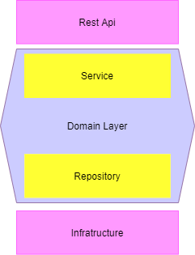

# Operación Quasar Fire :rocket:
## Desafio a completar :muscle:
Han Solo ha sido recientemente nombrado General de la Alianza
Rebelde y busca dar un gran golpe contra el Imperio Galáctico para
reavivar la llama de la resistencia.

El servicio de inteligencia rebelde ha detectado un llamado de auxilio de
una nave portacarga imperial a la deriva en un campo de asteroides. El
manifiesto de la nave es ultra clasificado, pero se rumorea que
transporta raciones y armamento para una legión entera.
## Propuesta 
El objetivo fue crear un programa que permitiera retornar la fuente y el contenido del mensaje de auxilio de la nave enemiga, para ello, como primer paso fue necesario triangular la posición dibujando circunferencias con respecto a tres coordenadas de tres satelites (Sato, Skywalker y  Kenobi) dados y tres distancias (radios), hallando la posición solo si las tres circunferencias dibujadas se interceptaban en un punto (coordenadas de la nave enemiga). Para ver la explicación matemática de la triangulación [clic aquí](./Trilateration.md). 
## Arquitectura
Para la arquitectura de la aplicación se usó Hexagonal Architecture. En la capa de dominio se implementó la lógica relacionada con la triangulación de la posición de la nave enemiga y el descifrado del mensaje de ayuda. 

Se definieron tres puertos dos para los servicios y uno para el manejo de los datos, puertos que los adaptadores de la capa rest e infraestructura respectivamente usaron para acceder a las funcionalidades que la capa de dominio les expone. A continuación se encuentra la representación de la arquitectura descrita anteriormente.





Los adaptadores corresponden a los servicios rest expuestos mediante Springboot y una implementación del manejo de datos que almacena los satelites en una lista.

## Versión en vivo
Puedes ver la versión en vivo [aquí](https://quasar-fire-application.azurewebsites.net/swagger-ui/index.html?configUrl=/v3/api-docs/swagger-config) .
## Instalación en ambiente local
### Prerrequisitos
Antes de empezar necesitas instalar las siguientes herramientas:

* Git [Descarga aquí](https://git-scm.com/downloads)
* Maven [Descarga aquí](https://maven.apache.org/download.cgi)
* Java Development Kit 8 [Descarga aquí](https://www.oracle.com/co/java/technologies/javase/javase-jdk8-downloads.html)
* IDE de tu preferencia.

### Instalación

1. Crear una carpeta en tu equipo local como workspace y allí clonar el proyecto en tu ambiente local con el siguiente comando.
```
git clone https://github.com/beltranfernanda/quasar-fire-challenge.git
```
2.  Desde  el IDE de tu preferencia importar el proyecto como maven project.
3.  Instalar las dependencias con el siguiente comando `mvn install`

4. Desde el IDE ubica la clase `QuasarfireApplication` y ejecútala como java application. 
5. Revisa el proyecto en la siguiente dirección `http://localhost:8080/swagger-ui.html`

### Test
Para ejecutar los casos de prueba y verificar la cobertura realiza lo siguiente:

1. Si te encuentras en Eclipse, clic derecho sobre la carpeta del proyecto `quasar-fire` y seleccionar `coverage as` -> `JUnitTest`
2. Si te encuentras en otro IDE diferente [clic aquí](https://junit.org/junit5/docs/current/user-guide/#running-tests).

## Despliegue en Azure
Sigue los siguientes pasos para desplegar tu proyecto en Azure:

1. Registrate en la página oficial de [Azure](https://azure.microsoft.com/en-us/free/search/?&ef_id=EAIaIQobChMIjb3GsLm78QIVDpWGCh301gM8EAAYASAAEgIrVPD_BwE:G:s&OCID=AID2100025_SEM_EAIaIQobChMIjb3GsLm78QIVDpWGCh301gM8EAAYASAAEgIrVPD_BwE:G:s&gclid=EAIaIQobChMIjb3GsLm78QIVDpWGCh301gM8EAAYASAAEgIrVPD_BwE) y crea tu cuenta gratuita.
2. Instala [Azure CLI](https://docs.microsoft.com/en-us/cli/azure/install-azure-cli).
3. Desde una consola ejecuta el siguiente comando para acceder a tu cuenta `az login`.
4. Construye el artefacto de la aplicación con el siguiente comando `mvn package`.
5. Despliega la aplicación  con el siguiente comando `mvn azure-webapp:deploy`.


## Construido con 
*  [Springboot 2.5.2](https://spring.io/quickstart) 

## Authors
Maria Fernanda Velandia Beltran
