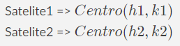
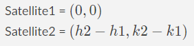
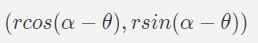
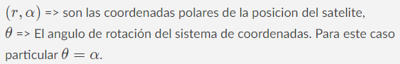
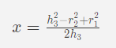
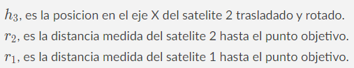
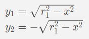
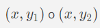
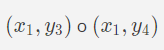

# Trilateracion

La triletaracion consiste en hallar la posicion de un objetivo teniendo en cuenta su posicion relativa a 3 puntos de referencia, mediante los cuales se puede intersectar el punto objetivo. 

## Algoritmo

Para calcular la posicion de la nave enemiga se realiza el siguiente procedimiento.

### Paso 1
Se toman dos Satelites como referencia. Para esto, se cambia el sistema de coordenadas para que el origen se encuentre en el primer satelite. 

Las nuevas posiciones son las siguientes

### Paso 2
Ahora se procede a rotar el sistema de coordenadas para que el segundo satelite se encuentre sobre el eje X.

Ahora la nueva posicion del satelite 2 es:

 
Donde, 

### Paso 3
Una vez están alineados sobre el eje X se procede a calcular la intersección de los circulos en el eje X.
Para esto se aplica la fórmula

Donde, 

### Paso 4
Con el valor de ***x*** hallado, se procede a calcular ***y***. 
Se puede obtener dos posibles resultados, de acuerdo a la siguiente fórmula

### Paso 5
Se obtiene dos puntos posibles de solucion

### Paso 6
Se realizan los pasos 1 a 5 con los satelites 1 y 3 para obtener los puntos solucion entre estos dos

### Paso 7
Se comparan los 4 puntos solucion obtenidos en los pasos 5 y 6, si se encuentran al menos dos iguales entonces será el resultado de la trilateración. Si no se encuentra un par de puntos iguales entonces no tiene solución.